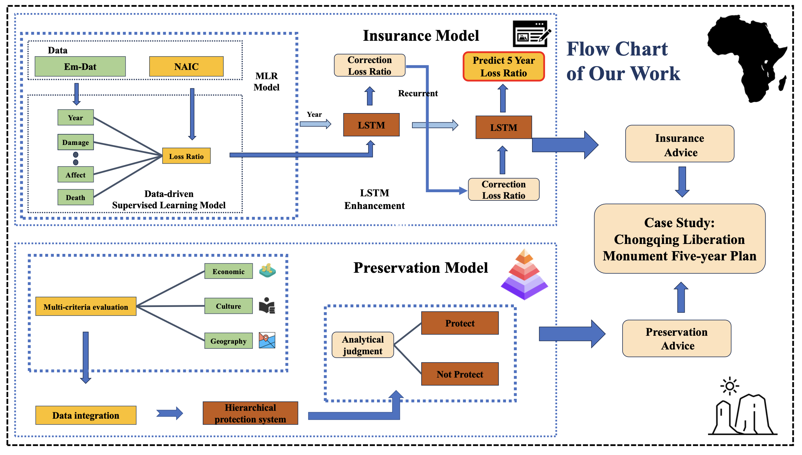

# Machine Learning-based Insurance and Preservation Model
## Project Overview
This project addresses the challenges faced by the property and casualty insurance industry due to increasing natural disasters. We develop models to promote sustainable insurance practices and assess the preservation needs ofs.

## Background
In a world, the frequency of natural presents new challenges for the insurance industry. This project aims to explore solutions through predictive and preservation.

## Models

### Insurance Model
- **Objective:** Analyze the impact of extreme weather on Loss Ratios to guide decisions.
- **Techniques:**
  - **Multiple Linear (MLR):** Used to predict Loss Ratiss based on historical data.
  - **Long Short-Memory (LSTM):** Incorporates time-series data for future predictions.
- **Metrics:** Evaluated using Mean Squared Error (MSE) and R-Squared values.

### Preservation Model
- **Objective:** Evaluate and rank buildings based on preservation needs.
- **Method:** 
- **Weighted Average:** Calculates the value for prioritisation.
- **Application:** Helps in developing protection measures for different levels of preservation.

## Results
- **Model:** Demonstrated through Monte Monte sensitivity analysis.
- **Recommendations:** Based on an 80 percent threshold for Loss Ratios.

